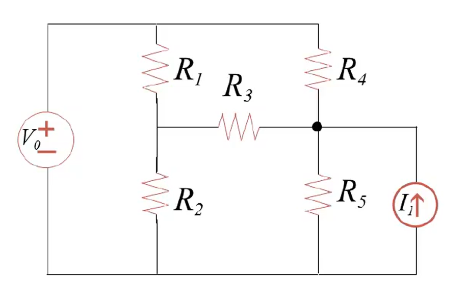
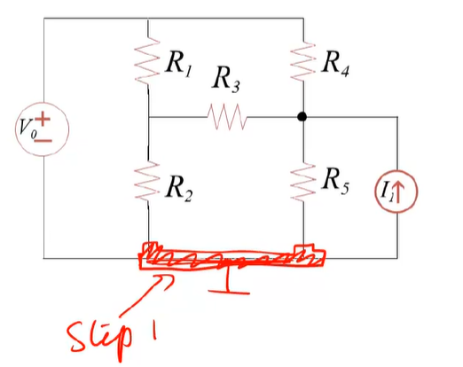
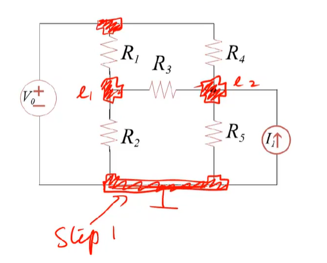
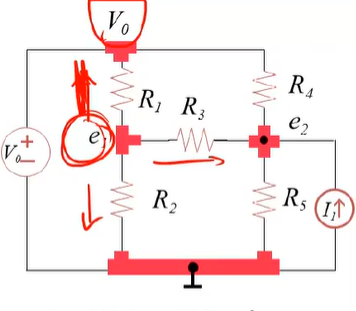

[节点电压法 (文章) | 直流电路分析 | 可汗学院 (khanacademy.org)](https://zh.khanacademy.org/science/electrical-engineering/ee-circuit-analysis-topic/ee-dc-circuit-analysis/a/ee-node-voltage-method)
# MITx 的做法：
1. 选取接地点
2. 用$e_k$标出除接地点外的结点电位
3. 对每个结点列KCL方程
4. 求解方程并求其他量
## 例题

### 选取接地点
选择连接元件最多的那个结点或**连接电压源负极**的结点
此处为

###  用$e_k$标出除接地点外的结点电位

图中最上面的结点的电位可以不用标出，因为它和地之间有一个电压源，所以它的电位大小为$V_0$
可直接记作$V_0$
### 对每个结点列KCL方程
对$e_1$列KCL：
首先设经过$e_1$的电流都是向外的，画出图来：

看从$e_1$到$V_0$的电流，由于沿着电流的方向电压减小，而$I=\frac{U}{R}=UG$，所以可以这样表示$I$：
$$(e_1-V_0)G_1$$。
同理，其他两个电流：
$$ (e_1-e_2)G_3 $$
$$ (e_1-0)G_2 $$
根据KCL，流入结点的电流等于流出的，流入的为0，流出的已经表示出来了，所以可得：
$$(e_1-V_0)G_1+(e_1-e_2)G_3+(e_1-0)G_2=0$$
同理可得$e_2$的KCL方程：
$$(e_2-e_1)G_3+(e_2-V_0)G_4+(e_2)G_5=I_1$$
**流出的 = 流入的**
### 求解方程
两个方程，$e_1$和$e_2$是未知数，所以得把两个未知数提出来，常量写到右边（写成$ax_1+bx_2=c$）：
$$(G_1+G_2+G_3)e_1-G_3e_2=V_0G_1$$
$$-G_3e_1+(G_3+G_4+G_5)e_2=I_1+V_0G_4$$
写成矩阵形式：
$$\begin{bmatrix}
 G_1+G_2+G_3 & -G_3\\
 -G_3 &G_3+G_4+G_5
\end{bmatrix}\begin{bmatrix}
 e_1 \\
e_2
\end{bmatrix}=\begin{bmatrix}
 V_0G_1\\
I_1+V_0G_4
\end{bmatrix}$$
对于本阶段的题目，直接按**中学**的求解多元一次方程组的方式求解即可，没有必要使用矩阵的方式求解（1. 求电导矩阵的逆矩阵$A^{-1}=\frac{1}{|A|}A^*$ 2.逆矩阵和电流矩阵相乘得到结果）。
# 常用的方式
观察上面整理后的方程，可以得出：
$$与结点直接相连的电导\times e-与相邻结点相连的电导\times e_{相邻}=流入电流$$
所以第3步对每个结点列KCL方程可以直接这么列。
上面的未标出的$e_3$已知，为$V_0$，一般把 $e_3=V_0$ 叫做 **增补方程**。
其他步骤和上面相同。
注意：当**有电压源和电阻串联**时，如例题中的$e_1$，那么就可以**求出这个支路的电流**为$V_0G_1$，方向为电压降低的方向，写在等号右边即可。
当**有受控源**时，将受控源当成独立源一样对待，即按前面的独立电压源和电流源的方法求解，并添加增补方程：将受控源的控制量用结点电压表示。
